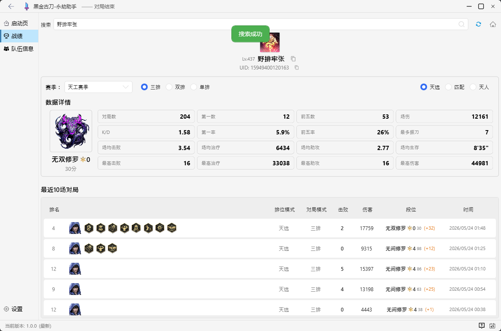
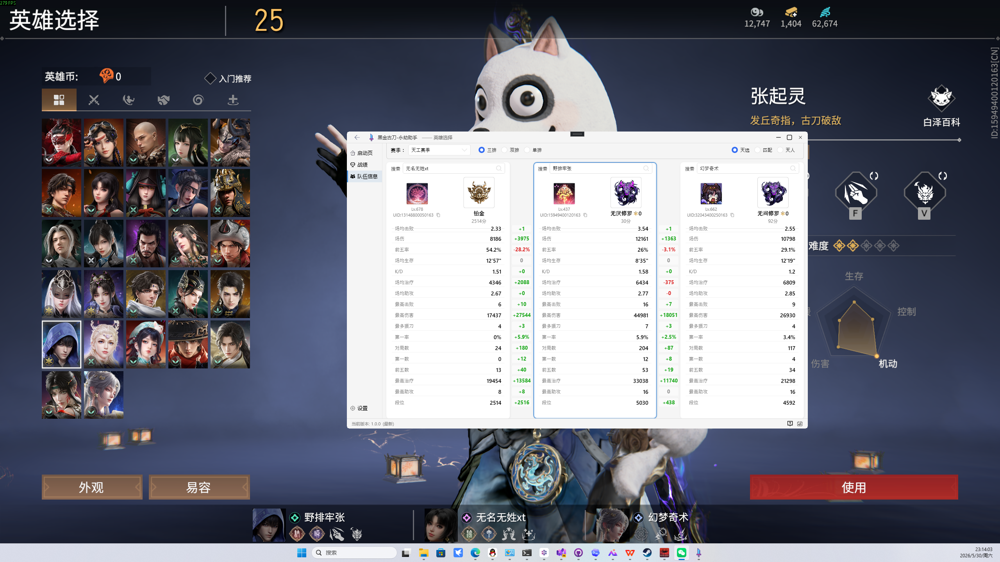
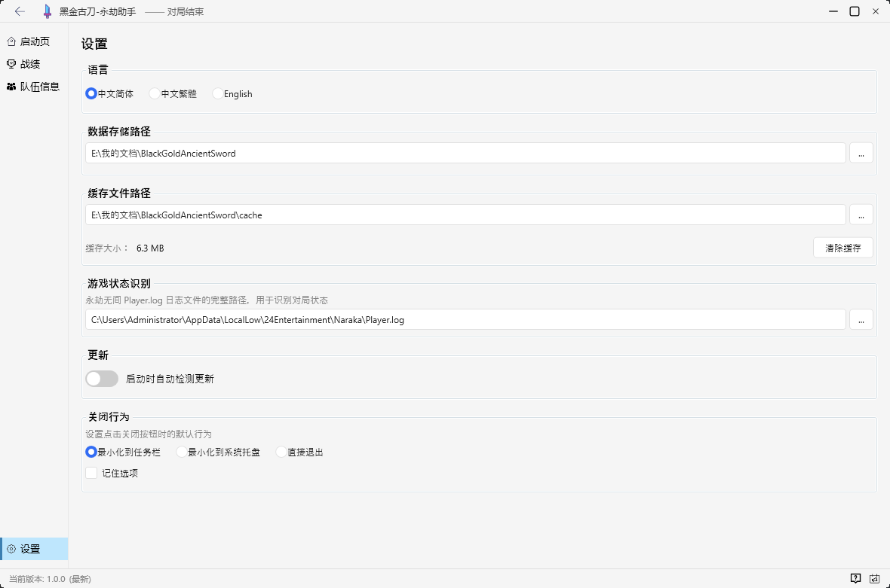
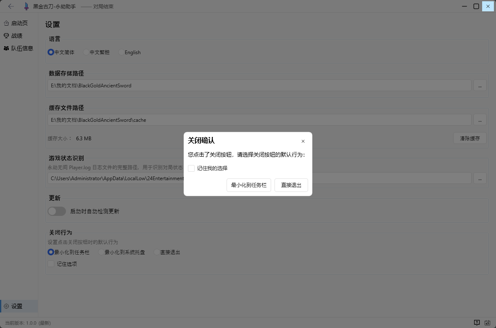

# 黑金古刀-永劫助手（BlackGoldAncientSword）

> 查询《永劫无间》（NARAKA: BLADEPOINT）玩家战绩数据的桌面辅助工具。

[]() []() []()

> 该项目受到 [Zzaphkiel/Seraphine](https://github.com/Zzaphkiel/Seraphine) 的鼓舞，感谢先驱者们做出的贡献。

---

# 用户手册

## 简介

**黑金古刀-永劫助手**是一款运行在 Windows 上的桌面应用。它可以在游戏过程中自动检测游戏状态、识别队友信息，并实时查询玩家战绩数据。无需切出游戏打开网页，助手将战绩数据直接呈现在桌面端，支持**三排 / 双排 / 单排**及**排位 / 匹配 / 天人**模式的完整数据统计。


## 战绩查询

战绩页面是助手的核心功能。在搜索框中输入玩家昵称，即可查询该玩家的完整战绩数据：

- **赛季数据总览**：K/D、第一率、前五率、场均击败、场均治疗、场均助攻、场均生存
- **最高记录**：最高击败、最高治疗、最高助攻、最高伤害、最多振刀
- **段位信息**：当前赛季段位分数与段位名称（天选模式含星数）
- **最近 10 场对局**：每局英雄、模式、击败/伤害、段位分变化（含 ± 差值）、荣誉称号

支持切换赛季、模式类别（排位 / 匹配 / 天人）和队伍规模（三排 / 双排 / 单排）。



> 点击玩家昵称旁的复制按钮可快速复制昵称或 UID。

---

## 队伍信息 —— 智能识别

进入游戏英雄选择界面后，助手会自动截取屏幕并识别队友昵称，将队友的赛季战绩数据并排展示，方便快速评估队伍实力。

- 自动识别队友昵称（无需手动输入）
- 支持三排 / 双排 / 单排队伍
- 支持排位 / 匹配 / 天人模式切换
- 队伍成员关键数据对比展示
- 在进入对局后**锁定队伍信息**，无需再次识别



> 可随时点击"重新识别队伍信息"按钮手动触发识别。

---

## 设置

设置页面集中管理应用配置：

- **数据保存路径**：战绩数据的本地存储目录（支持自定义 + 旧数据自动迁移）
- **缓存路径**：图片缓存目录（含缓存大小显示与一键清理）
- **语言**：支持 简体中文 / English / 繁體中文
- **关闭行为**：点击关闭按钮时"最小化到托盘"或"直接退出"
- **自动检查更新**：启动时检测新版本（基于 NetSparkle）
- **当前版本**：显示版本号



---

## 其他功能

### 系统托盘

助手支持最小化到系统托盘，游戏过程中不打扰。右键托盘图标可快速恢复窗口或退出。



- 托盘图标显示在线状态
- 点击关闭按钮时弹出确认对话框，提醒"退出程序会停止检测游戏"

### Toast 通知

操作成功/失败时会在窗口右下角弹出 Toast 提示（如"复制成功""缓存已清除"）。

### 自动更新

后台自动检测 GitHub Releases 上的新版本，支持"跳过此版本""稍后提醒""下载并安装"。

---


## 常见问题 FAQ 🧐

**Q：我会因为使用黑金古刀而被封号吗 😨？**

本程序仅读取游戏日志文件（Player.log）和截取英雄选择界面进行 OCR 识别，不对游戏文件、内存进行任何修改或注入，因此极大概率不会被封号，但并不保证一定不会封号。

**Q：为什么战绩查询不到 / 数据更新有延迟？**

战绩数据来源于 https://naraka.drivod.top/ 提供的相同 API 接口，由大佬 craftwyrd 提供。程序只负责展示数据，如果遇到数据查询不到或更新延迟，原因基本出在 API 服务器本身，与本程序大概率没啥关系~

**Q：为什么队友识别失败或不准确？**

OCR 识别采用的 OBS 录屏同源技术，可以忽略游戏的遮挡界面直接从显卡层面进行截图，但目前只支持屏幕与游戏相同分辨率进行识别。如果屏幕分辨率与游戏不一致，游戏会出现两侧黑边，尽量不要这样子进行游戏。最好保持最高分辨率或者与显示器同分辨率的全屏下进行游戏。

另外，OCR 有时无法识别某些特殊字符，如果遇到识别不出的情况，可以考虑使用 QQ 截图文字识别等方式手动补充。

---


## 免责声明 📢

BlackGoldAncientSword（黑金古刀）未经 24 Entertainment 或网易认可，不代表 24 Entertainment、网易或任何官方参与制作或管理《永劫无间》产品的人的观点或意见。《永劫无间》及其所有关联产物均为 24 Entertainment / 网易的商标或注册商标。

---

## 套盾环节 🛡️

本程序为在 GitHub 仓库 [ViewSuSu/BlackGoldAncientSword](https://github.com/ViewSuSu/BlackGoldAncientSword) 开源的代码，以及在 Release 或官方 QQ 群组中上传的二进制文件。本环节旨在让用户更加全面详尽地了解本程序以及可能的风险，以便用户在使用本程序前及过程中做出充分的风险评估和明智的决策。

本程序的目的是通过为游戏玩家提供游戏外辅助功能（战绩查询、队伍信息识别等），从而给玩家提供更好的游戏体验。我们不鼓励不支持任何违反 24 Entertainment 及网易规定或任何可能导致游戏环境不公平的行为。

本程序通过读取游戏日志文件（Player.log）和截取屏幕进行 OCR 识别来实现功能，其代码与行为均不含任何侵入性手段，因此在理论上并不会做出任何破坏客户端以及游戏完整性的行为，包括但不限于客户端文件内容的修改或游戏进程内存的读写等。

我们尽力保证本程序软件本体以及使用时游戏客户端的稳定性，但尽管如此，在具体的游戏环境以及官方服务更新的过程中（如反作弊系统或其他保护手段的更新），使用本程序可能会对您的游戏体验产生负面影响，如游戏闪退、账号封禁等。

使用本程序所产生的一切后果将由您自行承担，我们不对因使用本程序而产生的任何直接或间接损失负责，用户在决定使用本程序时，应充分考虑并自行承担由此产生的所有风险和后果。

我们保留随时修改本免责声明的权利，请定期查阅此页面以获取最新信息。

在您使用本程序之前，请确保您已经详细阅读、理解并同意免责声明中的条款；同时，请遵守相关游戏规则，共同维护健康和公平的游戏环境。


## 点个 Star 支持我们 ⭐

[](https://star-history.com/#ViewSuSu/BlackGoldAncientSword&Date)


## 反馈与交流

- **客户端问题反馈群**：146088141
- **数据问题反馈群**（QQ 群机器人也可查战绩）：
  - ①群：476074617
  - ②群：649891198
  - ③群：966720321
  - QQ 等级超过 32（两个太阳）自动审核进群，小号不予通过
- **网页端**：https://naraka.drivod.top/

---

<br>
<br>
<br>

# 开发者文档

## 项目架构概览

```
┌──────────────────────────────────────────┐
│          BlackGoldAncientSword.App       │  ← WPF 启动项目
│          (Shell / MainWindow)            │
└────────────────────┬─────────────────────┘
                     │
     ┌───────────────┼───────────────┐
     │               │               │
     ▼               ▼               ▼
┌─────────┐  ┌─────────────┐  ┌───────────┐
│ Modules │  │  Framework  │  │ Resources │
│ (7 UI   │  │  (Core +    │  │ (Strings, │
│  Pages) │  │   Services) │  │  Images)  │
└────┬────┘  └──────┬──────┘  └───────────┘
     │              │
     ▼              ▼
┌──────────┐  ┌──────────────┐
│GameMonitor│  │ScreenCapture │
│(进程/日志)│  │  (WGC API)   │
└─────┬─────┘  └──────┬───────┘
      │               │
      ▼               ▼
┌──────────┐  ┌──────────────┐
│   Ocr    │  │ PaddleOCR-   │
│ (OCR引擎)│  │  json.exe    │
└──────────┘  └──────────────┘
```

### 分层设计

| 层 | 项目 | 职责 |
|---|---|---|
| **Shell（外壳）** | `BlackGoldAncientSword.App` | WPF 应用入口、主窗口、导航、托盘、更新 |
| **UI 模块** | `BlackGoldAncientSword.Modules` | 7 个独立页面模块，按需加载 |
| **核心框架** | `BlackGoldAncientSword.Framework` | MVVM 基类、Prism 基础设施、HTTP API、本地化、设置 |
| **游戏监控** | `BlackGoldAncientSword.GameMonitor` | 进程检测、游戏日志解析、状态机 |
| **屏幕捕获** | `BlackGoldAncientSword.ScreenCapture` | Windows Graphics Capture API，SharpDX |
| **OCR 引擎** | `BlackGoldAncientSword.Ocr` | PaddleOCR-json 封装 |
| **资源** | `BlackGoldAncientSword.Resources` | 多语言 XAML 资源字典、图标 |
| **源码生成** | `BlackGoldAncientSword.Framework.SourceGenerator` | 编译时从 JSON 定义生成 HTTP 客户端 |
| **测试** | `BlackGoldAncientSword.Tests` | OCR 与屏幕捕获测试 |

---

## 技术栈

| 类别 | 技术 / 库 | 用途 |
|---|---|---|
| **运行时** | .NET 10.0 (net10.0-windows) | 目标框架 |
| **UI** | WPF + HandyControl 3.5 | 桌面界面与控件库 |
| **MVVM 框架** | Prism 8.1 (DryIoc) | DI 容器、区域导航、模块化 |
| **HTTP** | 编译时源码生成器 | 从 JSON 定义自动生成 API 客户端 |
| **对象映射** | Mapster 7.4 | DTO ↔ ViewModel |
| **JSON** | Newtonsoft.Json 13 | 序列化 / 反序列化 |
| **屏幕捕获** | SharpDX + 原生 WGC DLL (C++) | 游戏窗口截图 |
| **OCR** | PaddleOCR-json.exe | 中文字符识别 |
| **系统托盘** | Hardcodet.NotifyIcon.Wpf | 托盘图标与菜单 |
| **自动更新** | NetSparkle 3.1 | 版本检测与静默更新 |
| **打包** | Self-Contained + PublishSingleFile | 单文件独立部署 (win-x64) |

---

## 项目结构

```
src/
├── BlackGoldAncientSword.App/              # WPF 启动项目
│   ├── App.xaml / App.xaml.cs              # 应用入口与 Prism 启动配置
│   ├── Shell/
│   │   ├── MainWindow.xaml                 # 主窗口布局（侧边栏+导航+托盘）
│   │   └── MainWindowViewModel.cs          # 导航命令、游戏状态、更新检测
│   └── BlackGoldAncientSword.App.csproj
│
├── BlackGoldAncientSword.Framework/        # 核心框架
│   ├── Core/
│   │   ├── Bases/ViewModels/ViewModelBase.cs  # MVVM 基类 (RaisePropertyChanged)
│   │   ├── Bases/Views/                        # View 基类
│   │   ├── Consts/PageNames.cs                 # 页面名称常量
│   │   ├── Events/                             # Prism EventAggregator 事件
│   │   ├── Extensions/                         # 扩展方法
│   │   └── Infrastructure/                     # 导航接口等
│   ├── Http/
│   │   └── Definitions/                        # API JSON 定义 → 源码生成
│   ├── Services/
│   │   ├── Abstractions/                       # 服务接口 (7个)
│   │   └── Implementation/                     # 服务实现
│   ├── Themes/Generic.xaml                     # HandyControl 主题
│   └── UI/Controls/                            # 自定义 WPF 控件
│
├── BlackGoldAncientSword.Modules/          # UI 页面模块
│   ├── Module/                               # Prism IModule 注册 (7个)
│   └── UI/
│       ├── Announcement/                     # 公告页
│       ├── ClosePrompt/                      # 关闭确认弹窗
│       ├── Home/                             # 首页（游戏状态监控）
│       ├── Search/                           # 搜索历史
│       ├── Settings/                         # 设置页
│       ├── Stats/                            # 战绩查询
│       └── TeamInfo/                         # 队伍信息（OCR识别+对比）
│
├── BlackGoldAncientSword.GameMonitor/      # 游戏监控
│   ├── Models/                               # GameStatus, BattleEventArgs
│   └── Services/
│       ├── GameLogMonitor.cs                 # Player.log 解析
│       ├── GameStatusMonitor.cs              # 游戏状态状态机
│       └── PlayerPrefsService.cs             # 本地用户偏好
│
├── BlackGoldAncientSword.ScreenCapture/     # 屏幕捕获
│   ├── ScreenCaptureService.cs              # WGC 封装
│   └── runtimes/win-x64/native/
│       └── wgc_capture.dll                  # 原生 C++ 捕获库
│
├── BlackGoldAncientSword.Ocr/               # OCR 引擎
│   └── (PaddleOCR-json.exe 封装)
│
├── BlackGoldAncientSword.Resources/         # 多语言资源
│   └── Themes/
│       ├── Strings.zh-CN.xaml               # 简体中文
│       ├── Strings.en.xaml                  # English
│       └── Strings.zh-TW.xaml               # 繁體中文
│
└── BlackGoldAncientSword.Tests/             # 测试项目
```

---

## 核心模块说明

### 1. MVVM 架构（Prism + DryIoc）

项目使用 **Prism 8.1** 作为 MVVM 框架，**DryIoc** 作为 DI 容器：

- 所有 ViewModel 继承自 `ViewModelBase`，提供 `RaisePropertyChanged()` 方法（遵循 AGENTS.md 规范，禁止 `SetProperty` 封装）
- 属性变更通知使用 `nameof()` 或 `[CallerMemberName]`，禁止硬编码属性名字符串
- 页面通过 `IMainContentNavigationService` 进行导航，支持前进/后退
- 跨模块通信使用 `IEventAggregator` 发布/订阅事件（如 `TipMessageEvent`）

### 2. 模块化加载

7 个 UI 页面各是一个 Prism `IModule`，在 `ModuleCatalogConfigManager` 中配置为 `OnDemand` 模式——首次导航到某页面时才加载对应模块，减少启动时间。

```csharp
// PageNames.cs
public static class PageNames
{
    public const string HomePage     = nameof(HomePage);
    public const string StatsPage    = nameof(StatsPage);
    public const string SearchPage   = nameof(SearchPage);
    public const string TeamInfoPage = nameof(TeamInfoPage);
    public const string SettingsPage = nameof(SettingsPage);
    public const string AnnouncementPage = nameof(AnnouncementPage);
    public const string ClosePromptPage  = nameof(ClosePromptPage);
}
```

### 3. 游戏状态监控（GameMonitor）

`GameLogMonitor` 通过**定时轮询 Player.log** 文件来检测游戏事件：

- `BattleJoined` — 进入英雄选择（解析日志中的 RoomId）
- `BattleStarted` — 对局开始（解析 BattleId）
- `BattleEnded` — 对局结束

`GameStatusMonitor` 维护游戏状态机，通知各页面当前处于哪个阶段（`HeroSelection` / `InGame` / `BattleEnded`）。

`HomePageViewModel` 额外使用 `Process.GetProcessesByName("NarakaBladepoint")` 检测进程是否存在，作为辅助判断。

### 4. 屏幕捕获与 OCR（队伍信息识别）

队伍信息识别流程：

1. `GameStatusMonitor` 检测到 `HeroSelection` 状态
2. `TeamInfoPageViewModel` 启动 OCR 轮询循环
3. `ScreenCaptureService` 通过 **Windows Graphics Capture API**（原生 C++ DLL → SharpDX D3D11）截取游戏窗口
4. `OcrService` 调用 **PaddleOCR-json.exe** 进程识别截图中的中文文本
5. `TeamInfoOcrService` 解析 OCR 结果，提取队友昵称
6. 调用战绩 API 查询每个队友的数据，并排展示

### 5. HTTP API 源码生成

API 客户端不手写，而是通过 `BlackGoldAncientSword.Framework.SourceGenerator` 在编译时从 `Http/Definitions/*.json` 自动生成。JSON 定义文件描述了 API 的端点、请求/响应数据结构，源码生成器产出强类型的 HTTP 客户端代码。

### 6. 多语言支持

多语言通过 WPF `ResourceDictionary` 实现，所有 UI 文本定义在 `Strings.xx.xaml` 中。运行时通过 `ILocalizationService.ApplyLanguage()` 动态切换资源字典，无需重启。

### 7. 自动更新（NetSparkle）

基于 NetSparkleUpdater，在后台线程检测 GitHub Releases。更新对话框文本已全部中文化。支持跳过版本、稍后提醒、下载安装三个选项。

---

## 关键设计决策

| 决策 | 说明 |
|---|---|
| **单文件发布** | `PublishSingleFile=true` + `SelfContained=true`，产出单个 `.exe`，无需安装 .NET 运行时 |
| **禁止 SetProperty** | ViewModel 基类仅提供 `RaisePropertyChanged`，避免过度封装 |
| **属性名硬编码禁止** | 调用 `RaisePropertyChanged` 时必须用 `nameof()` 或 `[CallerMemberName]` |
| **Allman 花括号** | 所有 C# 代码使用 Allman 风格（花括号独占一行） |
| **commit message 中文** | 所有 git commit 必须使用中文撰写，详细说明改动内容 |
| **源码生成 API 客户端** | 减少手写 HTTP 调用代码，确保类型安全 |
| **OnDemand 模块加载** | 非首屏模块按需加载，优化启动性能 |

---

## 构建与运行

### 环境要求

- Windows 10/11 x64
- .NET 10.0 SDK
- PowerShell (UTF-8 环境)

### 构建命令

```powershell
# 还原依赖
dotnet restore src/BlackGoldAncientSword.App/BlackGoldAncientSword.App.csproj

# Debug 编译
dotnet build src/BlackGoldAncientSword.App/BlackGoldAncientSword.App.csproj -c Debug

# Release 发布（生成单文件 exe）
dotnet publish src/BlackGoldAncientSword.App/BlackGoldAncientSword.App.csproj -c Release -o publish/
```

### 运行测试

```powershell
dotnet test src/BlackGoldAncientSword.Tests/BlackGoldAncientSword.Tests.csproj
```

### 发布产物

发布后 `publish/` 目录下的 `BlackGoldAncientSword.App.exe` 即为可直接运行的独立程序。

### 项目地址

- GitHub: [ViewSuSu/BlackGoldAncientSword](https://github.com/ViewSuSu)
- 问题反馈: [Issues](https://github.com/ViewSuSu/BlackGoldAncientSword/issues/new)


---

## 特别鸣谢

- 微信号：craftwyrd

---

## 许可证

本项目基于 [MIT License](LICENSE) 开源。作者：**小窗同学**。