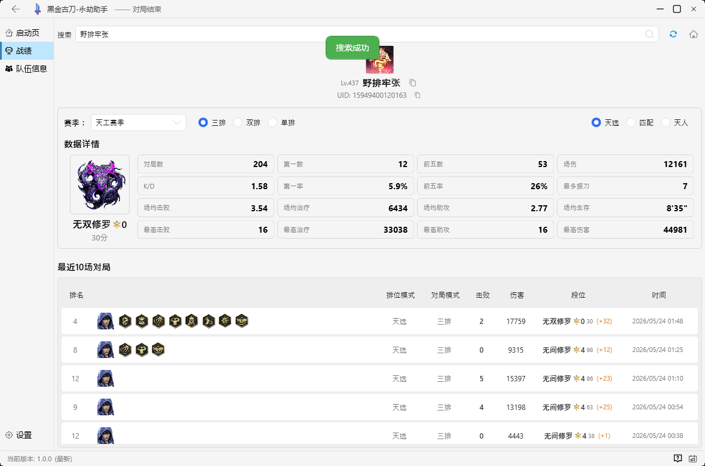
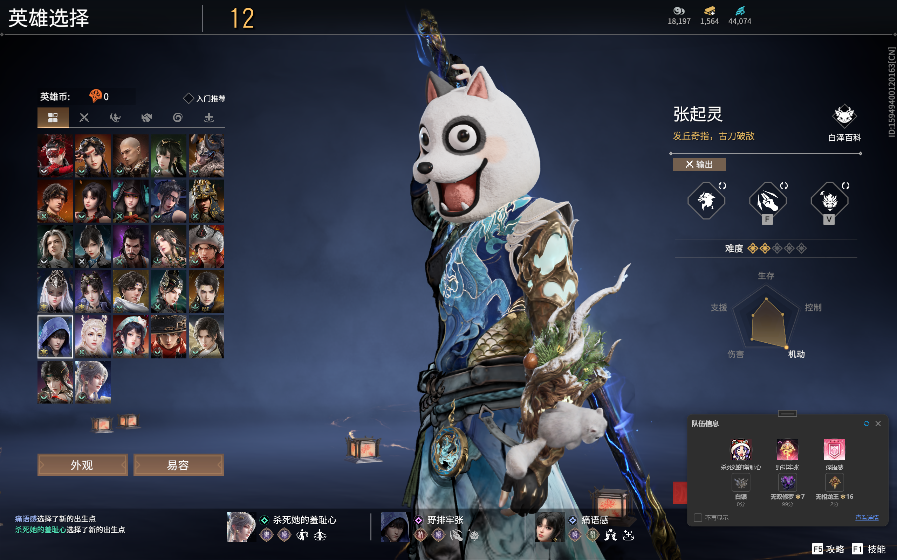
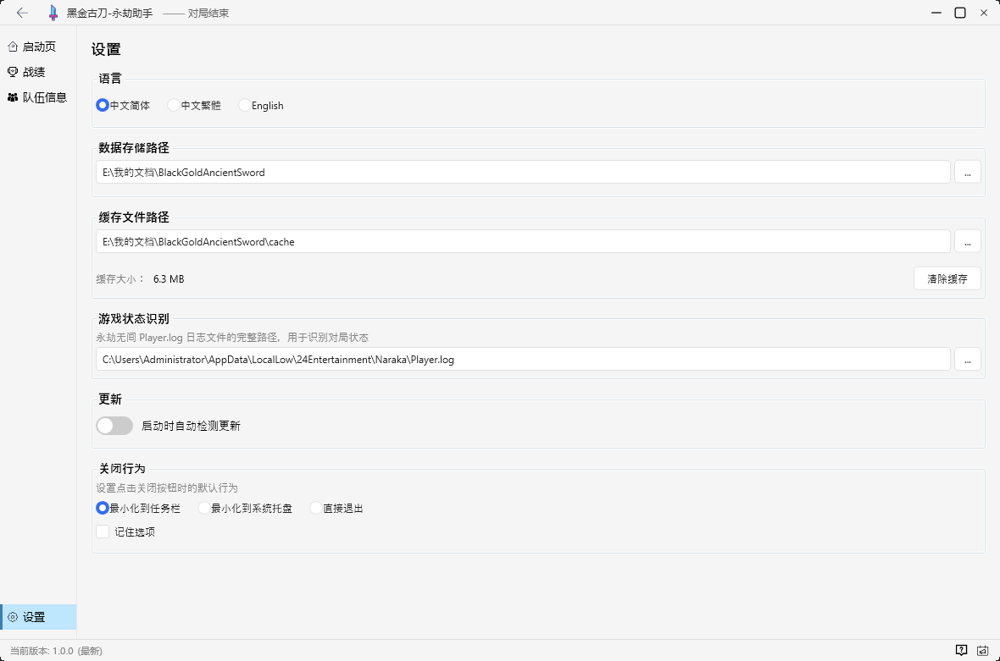
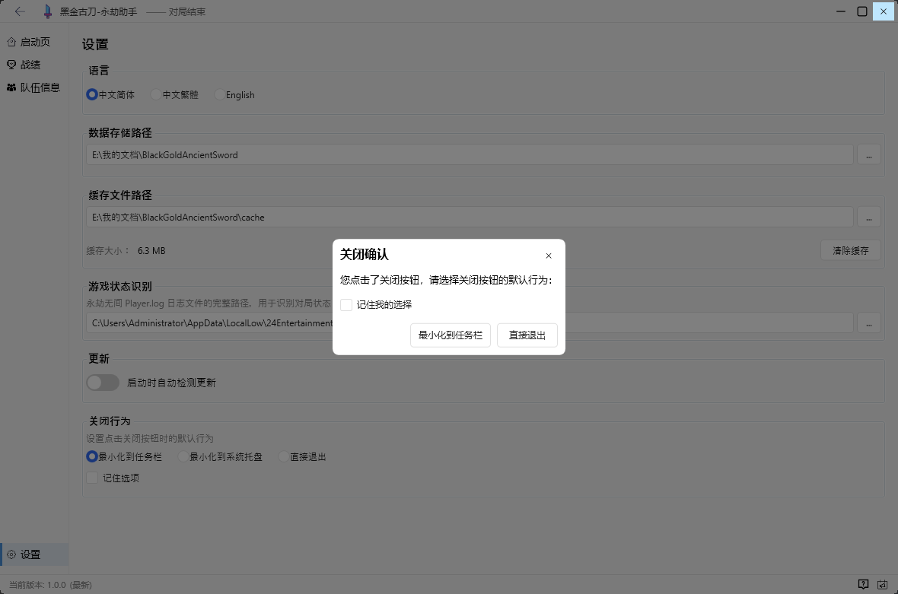

[中文](README.md) | [English](README.en.md)

[]() []() []() [](LICENSE)

# 黑金古刀-永劫助手（BlackGoldAncientSword）

> 查询《永劫无间》（NARAKA: BLADEPOINT）玩家战绩数据的桌面辅助工具。

> 该项目受到 [Zzaphkiel/Seraphine](https://github.com/Zzaphkiel/Seraphine) 的鼓舞，感谢先驱者们做出的贡献。

---

## 下载 📥

[](https://github.com/ViewSuSu/BlackGoldAncientSword/releases/latest/download/BlackGoldAncientSword-Setup.exe)

点击上方按钮即可直接下载最新版本的 .exe 安装包。

# 用户手册

## 简介

**黑金古刀-永劫助手**是一款运行在 Windows 上的桌面应用。它可以在游戏过程中自动检测游戏状态、识别队友信息，并实时查询玩家战绩数据。无需切出游戏打开网页，助手将战绩数据直接呈现在桌面端，支持**三排 / 双排 / 单排**及**排位 / 匹配 / 天人**模式的完整数据统计。

## 战绩查询

战绩页面是助手的核心功能。在搜索框中输入玩家昵称，即可查询该玩家的完整战绩数据：

- **赛季数据总览**：K/D、第一率、前五率、场均击败、场均治疗、场均助攻、场均生存
- **最高记录**：最高击败、最高治疗、最高助攻、最高伤害、最多振刀
- **段位信息**：当前赛季段位分数与段位名称（天选模式含星数）
- **最近 10 场对局**：每局英雄、模式、击败/伤害、段位分变化（含 ± 差值）、荣誉称号

支持切换赛季、模式类别（排位 / 匹配 / 天人）和队伍规模（三排 / 双排 / 单排）。

<p align="center">
  <br />
  <small><u>战绩</u></small>
</p>

> 点击玩家昵称旁的复制按钮可快速复制昵称或 UID。

---

## 队伍信息 —— 智能识别

进入游戏英雄选择界面后，助手会自动截取屏幕并识别队友昵称，将队友的赛季战绩数据并排展示，方便快速评估队伍实力。

- 自动识别队友昵称（无需手动输入）
- 支持三排 / 双排 / 单排队伍
- 支持排位 / 匹配 / 天人模式切换
- 队伍成员关键数据对比展示
- 在进入对局后**锁定队伍信息**，无需再次识别

<p align="center">
  <br />
  <small><u>队伍信息识别 1</u></small>
</p>

<p align="center">
  <br />
  <small><u>队伍信息识别 2</u></small>
</p>

> 可随时点击"重新识别队伍信息"按钮手动触发识别。当部分名字识别错误时，可直接修改识别出的名字并重新查询。

---

## 设置

设置页面集中管理应用配置：

- **数据保存路径**：战绩数据的本地存储目录（支持自定义 + 旧数据自动迁移）
- **缓存路径**：图片缓存目录（含缓存大小显示与一键清理）
- **语言**：支持 简体中文 / English / 繁體中文
- **关闭行为**：点击关闭按钮时的默认行为，可选"每次询问 / 最小化到任务栏 / 最小化到系统托盘 / 直接退出"，并支持记住选项
- **英雄选择时的右下角队伍提示弹窗**：开关控制
- **检查更新**：手动检查与下载新版本（调用独立的 Update 程序在线更新，详见下文）
- **当前版本**：显示版本号

<p align="center">
  <br />
  <small><u>设置</u></small>
</p>

---

## 在线更新

助手在启动时和"设置 → 检查更新"中均会自动比对 GitHub Releases 的最新版本。检测到新版本时会弹出更新提示页面，点击"在线更新"即可：

1. 主程序拉起独立的 **BlackGoldAncientSword.Update.exe**（更新器）并传入下载地址、安装目录、主程序文件名等参数；
2. 更新器下载新版 zip → 解压 → 全量覆盖安装目录 → 重新拉起主程序 → 自身退出。

> 更新器与主程序完全解耦（不引用 App / Framework / Modules），因此覆盖文件时不会被 DLL 锁定。

---

## 其他功能

### 系统托盘

助手支持最小化到系统托盘，游戏过程中不打扰。右键托盘图标可快速恢复窗口或退出。

<p align="center">
  <br />
  <small><u>关闭提示</u></small>
</p>

- 托盘图标显示在线状态
- 点击关闭按钮时弹出确认对话框，提醒"退出程序会停止检测游戏"

---

## 常见问题 FAQ 🧐

**Q：我会因为使用黑金古刀而被封号吗 😨？**

本程序仅读取游戏日志文件（Player.log）和截取英雄选择界面进行 OCR 识别，不对游戏文件、内存进行任何修改或注入，因此极大概率不会被封号，但并不保证一定不会封号。

**Q：为什么战绩查询不到 / 数据更新有延迟？**

战绩数据来源于 https://naraka.drivod.top/ 提供的相同 API 接口，由大佬 craftwyrd 提供。程序只负责展示数据，如果遇到数据查询不到或更新延迟，原因基本出在 API 服务器本身，与本程序大概率没啥关系~ 数据相关问题可在数据问题反馈群中提问，或直接联系 API 作者 craftwyrd。

**Q：为什么队友识别失败或不准确？**

OCR 识别采用的 OBS 录屏同源技术，可以忽略游戏的遮挡界面直接从显卡层面进行截图，但目前只支持屏幕与游戏相同分辨率进行识别。如果屏幕分辨率与游戏不一致，游戏会出现两侧黑边，尽量不要这样子进行游戏。最好保持最高分辨率或者与显示器同分辨率的全屏下进行游戏。

另外，OCR 有时无法识别某些特殊字符，如果遇到识别不出的情况，可以考虑使用 QQ 截图文字识别等方式手动补充。

**Q：为什么安装包/程序这么大（200MB+）？**

程序采用**自包含发布（self-contained）**，内置了 .NET 运行时，无需用户额外安装 .NET 环境即可直接运行。此外，程序自带的 OCR 文字识别引擎（PaddleOCR）需要依赖 Intel 数学核心库（mklml.dll，约 88MB）和 OpenCV 计算机视觉库（opencv_world4100.dll，约 62MB）。这两个原生 AI/视觉库连同 .NET 运行时占了安装包的绝大部分体积。没有它们就无法实现队友昵称的自动截图识别，所以"庞大"是必要的代价 😅。

**Q：为什么进入英雄选择环节时屏幕出现黄色边框？**

黄色边框是程序在进行截图识别的视觉提示，表示程序正在截取游戏画面并识别队友信息，属于正常现象，无需担心。

**Q：如果被杀毒软件提示怎么办？**

因为该程序没有被签名过，所以可能会被 360 等程序识别为病毒或者其他。可以关闭杀毒软件后重新打开。

**Q：在线更新失败怎么办？**

更新器（BlackGoldAncientSword.Update.exe）独立于主程序运行，常见失败原因：网络无法访问 GitHub、安装目录权限不足、杀毒软件拦截覆盖。可在 Releases 页面直接下载安装包手动覆盖安装。

---

## 免责声明 📢

BlackGoldAncientSword（黑金古刀）未经 24 Entertainment 或网易认可，不代表 24 Entertainment、网易或任何官方参与制作或管理《永劫无间》产品的人的观点或意见。《永劫无间》及其所有关联产物均为 24 Entertainment / 网易的商标或注册商标。

---

## 套盾环节 🛡️

本程序为在 GitHub 仓库 [ViewSuSu/BlackGoldAncientSword](https://github.com/ViewSuSu/BlackGoldAncientSword) 开源的代码，以及在 Release 或官方 QQ 群组中上传的二进制文件。本环节旨在让用户更加全面详尽地了解本程序以及可能的风险，以便用户在使用本程序前及过程中做出充分的风险评估和明智的决策。

本程序的目的是通过为游戏玩家提供游戏外辅助功能（战绩查询、队伍信息识别等），从而给玩家提供更好的游戏体验。我们不鼓励不支持任何违反 24 Entertainment 及网易规定或任何可能导致游戏环境不公平的行为。

本程序通过读取游戏日志文件（Player.log）和截取屏幕进行 OCR 识别来实现功能，其代码与行为均不含任何侵入性手段，因此在理论上并不会做出任何破坏客户端以及游戏完整性的行为，包括但不限于客户端文件内容的修改或游戏进程内存的读写等。

我们尽力保证本程序软件本体以及使用时游戏客户端的稳定性，但尽管如此，在具体的游戏环境以及官方服务更新的过程中（如反作弊系统或其他保护手段的更新），使用本程序可能会对您的游戏体验产生负面影响，如游戏闪退、账号封禁等。

使用本程序所产生的一切后果将由您自行承担，我们不对因使用本程序而产生的任何直接或间接损失负责，用户在决定使用本程序时，应充分考虑并自行承担由此产生的所有风险和后果。

我们保留随时修改本免责声明的权利，请定期查阅此页面以获取最新信息。

在您使用本程序之前，请确保您已经详细阅读、理解并同意免责声明中的条款；同时，请遵守相关游戏规则，共同维护健康和公平的游戏环境。


## 点个 Star 支持我们 ⭐

[](https://star-history.com/#ViewSuSu/BlackGoldAncientSword&Date)

## 反馈与交流

- **客户端问题反馈QQ群**：
  - ①群：146088141
- **数据问题反馈QQ群**（QQ 群机器人也可查战绩）：
  - ①群：476074617
  - ②群：649891198
  - ③群：966720321
  - QQ 等级超过 32（两个太阳）自动审核进群，小号不予通过
- **网页端**：https://naraka.drivod.top/

---

<br>
<br>
<br>

# 开发者文档

## 解决方案概览

`src/BlackGoldAncientSword.slnx` 共包含 **10 个项目**：8 个类库 + 2 个可执行程序（主程序 App、独立更新器 Update）。

```
┌────────────────────────────────────────────────────────┐
│             BlackGoldAncientSword.App                  │  ← WPF 主程序入口（WinExe）
│             (Shell / MainWindow / Tray)                │
└──────────┬─────────────────────────────────────────┬───┘
           │ 启动外部进程                              │
           ▼                                          │
┌──────────────────────────┐                          │
│ BlackGoldAncientSword.   │                          │
│ Update (独立更新器,WinExe)│                          │
│ 下载/解压/覆盖/重启       │                          │
└──────────────────────────┘                          │
                                                      │
        ┌─────────────────────┬──────────────────────┘
        │                     │
        ▼                     ▼                     ▼
┌────────────┐        ┌──────────────┐        ┌───────────┐
│  Modules   │        │  Framework   │        │ Resources │
│ (9 个 UI   │ ◄────► │ (Core + 13   │ ◄──────│ (多语言   │
│  页面模块) │        │ 个服务接口)  │        │  XAML+图) │
└─────┬──────┘        └──────┬───────┘        └───────────┘
      │                      │
      │             ┌────────┴───────┐
      ▼             ▼                ▼
┌──────────────┐ ┌──────────────┐ ┌────────────────────┐
│ GameMonitor  │ │ ScreenCapture│ │ Framework.         │
│ (进程/日志/  │ │ (WGC API +   │ │ SourceGenerator    │
│  状态机)     │ │  原生 DLL)   │ │ (编译期生成 HTTP)  │
└──────┬───────┘ └──────┬───────┘ └────────────────────┘
       │                │
       ▼                ▼
┌──────────────┐ ┌──────────────────┐
│     Ocr      │ │ PaddleOCR-json   │
│ (子进程封装) │ │  .exe + 模型     │
└──────────────┘ └──────────────────┘
```

### 项目分层

| 层 | 项目 | 输出类型 | 职责 |
|---|---|---|---|
| **主程序** | `BlackGoldAncientSword.App` | WinExe | WPF 应用入口、主窗口、侧边栏导航、托盘、启动更新器 |
| **更新器** | `BlackGoldAncientSword.Update` | WinExe | 独立在线更新进程，零业务依赖（仅 HandyControl） |
| **UI 模块** | `BlackGoldAncientSword.Modules` | ClassLib | 9 个 Prism `IModule` 页面，按需加载 |
| **核心框架** | `BlackGoldAncientSword.Framework` | ClassLib | MVVM 基类、Prism 基础设施、服务抽象与实现、HTTP API |
| **游戏监控** | `BlackGoldAncientSword.GameMonitor` | ClassLib | 进程检测、Player.log 解析、战局状态机 |
| **屏幕捕获** | `BlackGoldAncientSword.ScreenCapture` | ClassLib | Windows Graphics Capture API + SharpDX，含原生 wgc_capture.dll |
| **OCR 引擎** | `BlackGoldAncientSword.Ocr` | ClassLib | PaddleOCR-json.exe 子进程封装 |
| **资源** | `BlackGoldAncientSword.Resources` | ClassLib | 多语言 XAML 资源字典、图标、图片 |
| **源码生成** | `BlackGoldAncientSword.Framework.SourceGenerator` | Roslyn Analyzer | 编译期从 JSON 定义生成 HTTP 客户端与测试代码 |
| **测试** | `BlackGoldAncientSword.Tests` | xUnit | OCR、屏幕捕获、游戏监控、HTTP、更新流程测试 |

---

## 技术栈

| 类别 | 技术 / 库 | 用途 |
|---|---|---|
| **运行时** | .NET 10.0 (`net10.0-windows`) | 目标框架 |
| **UI** | WPF + HandyControl 3.5 | 桌面界面与控件库 |
| **MVVM 框架** | Prism 8.1 (`Prism.DryIoc`) | DI 容器、区域导航、模块化 |
| **HTTP** | 编译期源码生成器 | 从 `api-definitions.json` 自动生成强类型 API 客户端 |
| **对象映射** | Mapster 7.4 | DTO ↔ ViewModel |
| **JSON** | `System.Text.Json`（含源码生成上下文） | 序列化 / 反序列化（已全量替换 Newtonsoft.Json） |
| **屏幕捕获** | SharpDX.Direct3D11 + 原生 WGC DLL (C++/WinRT) | 游戏窗口截图 |
| **OCR** | PaddleOCR-json.exe（常驻子进程） | 多语言文字识别 |
| **系统托盘** | Hardcodet.NotifyIcon.Wpf | 托盘图标与菜单 |
| **测试** | xUnit + Moq | 单元测试与集成测试 |
| **打包** | Self-Contained + PublishSingleFile | App、Updater 均为单文件独立部署 (win-x64) |
| **安装包** | Inno Setup | 生成 `BlackGoldAncientSword-Setup.exe` |

---

## 目录结构

```
src/
├── BlackGoldAncientSword.App/              # WPF 主程序入口（WinExe）
│   ├── App.xaml / App.xaml.cs              # 应用入口、Prism 启动配置
│   └── Shell/
│       ├── MainWindow.xaml(.cs)            # 主窗口（侧边栏 + 导航 + 托盘）
│       └── MainWindowViewModel.cs          # 导航命令、游戏状态、更新检测
│
├── BlackGoldAncientSword.Update/           # 独立在线更新器（WinExe，零业务依赖）
│   ├── App.xaml(.cs)                       # 入口：解析 --url / --target / --main-exe
│   ├── Services/
│   │   ├── UpdateOptions.cs                # 命令行参数模型
│   │   └── UpdaterRunner.cs                # 编排：下载→解压→关主程序→覆盖→重启
│   ├── Shell/UpdateWindow.xaml(.cs)        # 进度窗口
│   └── ViewModels/UpdateViewModel.cs       # 进度与状态绑定
│
├── BlackGoldAncientSword.Framework/        # 核心框架
│   ├── Core/
│   │   ├── Attributes/                     # ComponentAttribute（DI 自动注册标记）
│   │   ├── Bases/                          # ViewModelBase、PrismApplicationBase 等
│   │   ├── Consts/                         # GlobalConstant、PageNames
│   │   ├── Events/                         # GameStatusChanged、SettingsChanged、TipMessageEvent
│   │   ├── Extensions/                     # 扩展方法与 Value Converter
│   │   └── Infrastructure/                 # IMainContentNavigationService / MainContentNavigator
│   ├── Http/
│   │   ├── Definitions/
│   │   │   ├── api-definitions.json        # API 端点 / 请求 / 响应定义（→ 源码生成）
│   │   │   └── enums.json                  # 枚举定义
│   │   └── JsonFlexibleStringConverter.cs  # System.Text.Json 容错转换器
│   ├── Services/
│   │   ├── Abstractions/                   # 13 个服务接口（见下表）
│   │   └── Implementation/                 # 服务实现
│   ├── Themes/Generic.xaml                 # HandyControl 主题
│   └── UI/Controls/                        # 自定义 WPF 控件（DataGridWrapPanel 等）
│
├── BlackGoldAncientSword.Framework.SourceGenerator/  # Roslyn 源码生成器
│   ├── ApiDefinitionsParser.cs             # 解析 api-definitions.json
│   ├── EnumSourceGenerator.cs              # 生成枚举类型
│   ├── HttpApiSourceGenerator.cs           # 生成 NarakaApiClient + DTO（Client 模式）
│   └── HttpApiTestSourceGenerator.cs       # 生成 HTTP API 测试代码（Tests 模式）
│
├── BlackGoldAncientSword.Modules/          # UI 页面模块（9 个 Prism IModule）
│   ├── Mappings/BattleMappingRegister.cs   # Mapster 映射注册
│   ├── Module/                             # 9 个 IModule 注册
│   │   ├── AnnouncementModule.cs           # 公告
│   │   ├── ClosePromptModule.cs            # 关闭确认弹窗
│   │   ├── FeedbackModule.cs               # 意见反馈
│   │   ├── HomeModule.cs                   # 首页（游戏状态监控）
│   │   ├── SearchModule.cs                 # 搜索历史
│   │   ├── SettingsModule.cs               # 设置
│   │   ├── StatsModule.cs                  # 战绩查询
│   │   ├── TeamInfoModule.cs               # 队伍信息（OCR + 对比）
│   │   └── UpdateNotificationModule.cs     # 新版本提示 / 启动更新器
│   └── UI/                                 # 各模块的 ViewModels + Views
│       ├── Stats/Services/                 # 战绩聚合服务
│       ├── TeamInfo/Services/              # TeamInfoOcrService、TeamOcrCoordinator
│       └── UpdateNotification/ViewModels/  # 拉起 BlackGoldAncientSword.Update.exe
│
├── BlackGoldAncientSword.GameMonitor/      # 游戏监控
│   ├── Models/                             # BattleEventArgs、PlayerPrefsData
│   ├── Services/
│   │   ├── Abstractions/                   # IGameLogMonitor / IGameStatusMonitor / IPlayerPrefsService
│   │   └── Implementation/
│   │       ├── GameLogMonitor.cs           # facade（编排生命周期与事件分发）
│   │       ├── GameStatusMonitor.cs        # 游戏状态状态机
│   │       ├── PlayerPrefsService.cs       # 本地用户偏好
│   │       └── Internal/
│   │           ├── BattleStateMachine.cs   # 战局状态机
│   │           ├── LogPoller.cs            # 轮询循环
│   │           └── LogReader.cs            # Player.log 读取
│   └── GameMonitorAutoRegister.cs          # 服务自动注册
│
├── BlackGoldAncientSword.ScreenCapture/    # 屏幕捕获（Windows Graphics Capture API）
│   ├── IScreenCaptureService.cs            # 服务接口
│   ├── ScreenCaptureService.cs             # WGC 封装
│   ├── NativeWgc.cs / WgcInterop.cs        # 原生 WGC API 互操作
│   ├── ScreenQuadrant.cs                   # 屏幕四象限分割
│   ├── native/                             # 原生 C++ 源码与构建脚本
│   └── runtimes/win-x64/native/
│       └── wgc_capture.dll                 # 原生 C++/WinRT 捕获库
│
├── BlackGoldAncientSword.Ocr/              # OCR 引擎
│   ├── IOcrService.cs                      # 服务接口
│   ├── OcrEngine.cs                        # PaddleOCR-json.exe 封装
│   ├── JobObjectHelper.cs                  # JobObject 兜底回收子进程
│   └── OcrAutoRegister.cs                  # 服务自动注册
│
├── BlackGoldAncientSword.Resources/        # 多语言资源
│   ├── Images/                             # UI 图片、应用图标 (app.ico)
│   └── Themes/
│       ├── Strings.zh-CN.xaml              # 简体中文
│       ├── Strings.en.xaml                 # English
│       └── Strings.zh-TW.xaml              # 繁體中文
│
└── BlackGoldAncientSword.Tests/            # 测试项目（xUnit + Moq）
    ├── GameMonitor/                        # 游戏监控测试
    ├── Http/                               # HTTP / JSON 容错测试（部分代码由源码生成器产出）
    ├── Ocr/                                # OCR 测试
    ├── ScreenCapture/                      # 屏幕捕获测试
    ├── Update/                             # 更新流程测试
    └── TestData/                           # 测试数据

ocr_engine/                                 # PaddleOCR-json 引擎与模型（被 Ocr 项目拷贝至输出目录）
├── PaddleOCR-json.exe                      # OCR 引擎可执行文件
├── models/                                 # OCR 模型（ch / cht / en / cyrillic / japan / korean）
└── *.dll                                   # 运行时依赖（onnxruntime、opencv_world、mklml 等）
```

---

## Framework 服务接口一览

`BlackGoldAncientSword.Framework/Services/Abstractions/` 下共 13 个公开接口：

| 接口 | 主要实现 | 用途 |
|---|---|---|
| `IAppAssemblyMarker` | `AppAssemblyMarker` | 程序集定位标记（XAML 资源解析） |
| `IApplicationLifetime` | `WpfApplicationLifetime` | 退出 / 重启应用 |
| `IClipboardService` | `WpfClipboardService` | 剪贴板读写 |
| `IGitHubReleaseService` | `GitHubReleaseService` | 拉取 GitHub Releases 列表与资产 |
| `IImageCacheService` | `ImageCacheService` | 图片磁盘缓存 |
| `ILocalizationService` | `LocalizationService` | 动态切换语言（重载 XAML 资源字典） |
| `ILocalizedTextProvider` | `WpfLocalizedTextProvider` | 代码侧读取本地化字符串 |
| `ISearchHistoryService` | `SearchHistoryService` | 搜索历史持久化 |
| `ISettingsService` | `SettingsService` | 应用配置读写 |
| `ITeamOverlayService` | `TeamOverlayService` | 英雄选择时的右下角队伍弹窗 |
| `ITipMessageService` | `TipMessageService` | 全局 Toast / 提示消息 |
| `IUIDispatcher` | `WpfUIDispatcher` | 跨线程 UI 调度封装 |
| `IUpdateService` | `UpdateService` | 比对版本、解析最新 release 的 zip 资产 URL |

`GameMonitor`、`Ocr`、`ScreenCapture` 各自暴露自身的接口（`IGameLogMonitor` / `IGameStatusMonitor` / `IPlayerPrefsService`、`IOcrService`、`IScreenCaptureService`），通过各模块的 `*AutoRegister.cs` 注册到 DI 容器。

---

## 核心模块说明

### 1. MVVM 架构（Prism + DryIoc）

- 所有 ViewModel 继承自 `ViewModelBase`，提供 `RaisePropertyChanged()` 方法（遵循 [CLAUDE.md](CLAUDE.md) / [AGENTS.md](AGENTS.md) 规范，禁止 `SetProperty` 封装）
- 属性变更通知使用 `nameof()` 或 `[CallerMemberName]`，禁止硬编码属性名字符串
- ViewModel 中**禁止引用 WPF 类型**（`Visibility`、`Brush`、`Color` 等）；可见性用 `bool` + Converter 表达
- 页面通过 `IMainContentNavigationService` 进行导航，支持前进 / 后退
- 跨模块通信使用 `IEventAggregator` 发布 / 订阅事件（如 `TipMessageEvent`、`SettingsChangedEvent`）

### 2. 模块化按需加载

9 个 UI 页面分别是一个 Prism `IModule`，在 `ModuleCatalogConfigManager` 中配置为 `OnDemand`：首次导航到某页面时才加载对应模块，减少启动时间。

```csharp
// PageNames.cs
public static class PageNames
{
    public const string HomePage               = nameof(HomePage);
    public const string StatsPage              = nameof(StatsPage);
    public const string SearchPage             = nameof(SearchPage);
    public const string TeamInfoPage           = nameof(TeamInfoPage);
    public const string SettingsPage           = nameof(SettingsPage);
    public const string AnnouncementPage       = nameof(AnnouncementPage);
    public const string ClosePromptPage        = nameof(ClosePromptPage);
    public const string FeedbackPage           = nameof(FeedbackPage);
    public const string UpdateNotificationPage = nameof(UpdateNotificationPage);
}
```

### 3. 游戏状态监控（GameMonitor）

`GameLogMonitor` 采用 **FileSystemWatcher + 定时轮询双保险** 监听 Player.log 文件变更。内部将职责拆分为：

- `LogReader`（文件读取）
- `LogPoller`（轮询循环）
- `BattleStateMachine`（战局状态机）

外层 `GameLogMonitor` 仅作为 facade 编排生命周期与事件分发。监测到的事件：

- `BattleJoined` — 进入英雄选择（解析日志中的 RoomId）
- `BattleStarted` — 对局开始（解析 BattleId）
- `BattleEnded` — 对局结束

`GameStatusMonitor` 维护游戏状态机，通知各页面当前处于哪个阶段（`HeroSelection` / `InGame` / `BattleEnded`）。`HomePageViewModel` 额外使用 `Process.GetProcessesByName("NarakaBladepoint")` 检测进程是否存在，作为辅助判断。

### 4. 屏幕捕获与 OCR（队伍信息识别）

队伍信息识别流程：

1. `GameStatusMonitor` 检测到 `HeroSelection` 状态
2. `TeamInfoPageViewModel` 启动 OCR 轮询循环
3. `ScreenCaptureService` 通过 **Windows Graphics Capture API**（原生 C++/WinRT DLL → SharpDX D3D11）截取游戏窗口，使用 `ArrayPool` 复用全帧缓冲，按 `ScreenQuadrant` 切出三个 region 拼图
4. `OcrEngine` 与 **PaddleOCR-json.exe** 之间是**单例常驻子进程 + stdin/stdout 管道 + image_base64 零磁盘 IO**：模型仅在首次调用 `PrewarmAsync` 时加载（约 600～1500 ms），后续每次识别只跑推理（约 100～250 ms）；`JobObject` 保证宿主退出时子进程被 OS 兜底清理
5. `TeamInfoOcrService` / `TeamOcrCoordinator` 解析 OCR 结果，提取队友昵称
6. 调用战绩 API 查询每个队友的数据，并排展示

### 5. HTTP API 源码生成

API 客户端**不手写**，而是通过 `BlackGoldAncientSword.Framework.SourceGenerator` 在编译期从 `Http/Definitions/*.json` 自动生成：

- JSON 定义文件描述 API 的端点、请求 / 响应数据结构与枚举
- 生成器以 **Roslyn Source Generator** 形式工作，被 Framework / Tests 两端以 Analyzer 引用
- 通过 `BgaSourceGenMode` 属性切换产物：
  - `Client` 模式（Framework）— 生成 `NarakaApiClient` + DTO
  - `Tests` 模式（Tests）— 生成 HTTP API 测试代码

### 6. 多语言支持

多语言通过 WPF `ResourceDictionary` 实现，所有 UI 文本定义在 `Strings.{zh-CN,en,zh-TW}.xaml` 中。运行时通过 `ILocalizationService.ApplyLanguage()` 动态切换资源字典，无需重启。

### 7. 在线更新（独立 Updater 进程）

更新由两端协作完成：

- **主程序侧**（`Modules/UI/UpdateNotification/ViewModels/UpdateNotificationPageViewModel.cs`）
  - 通过 `IUpdateService` + `IGitHubReleaseService` 检测新版本
  - 用户点击"在线更新"后，启动同目录下的 `BlackGoldAncientSword.Update.exe`，传入 `--url <zip 下载地址>`、`--target <安装目录>`、`--main-exe BlackGoldAncientSword.App.exe`
- **更新器侧**（`BlackGoldAncientSword.Update`）
  - 独立进程，不引用任何业务项目（仅依赖 HandyControl），避免 DLL 被锁定影响整目录覆盖
  - `UpdaterRunner` 编排：下载 zip（0–90%）→ 解压（90–98%）→ 提示关闭主程序 → 全量覆盖 → 重新拉起主程序 → 自身退出
  - 以 self-contained + `PublishSingleFile` + `EnableCompressionInSingleFile` 发布

---

## 构建与运行

### 环境要求

- Windows 10/11 x64
- .NET 10.0 SDK
- PowerShell 7+（推荐，UTF-8 环境）

### 构建命令

```powershell
# 还原 + 编译整个解决方案
dotnet build src/BlackGoldAncientSword.slnx

# 仅编译主程序
dotnet build src/BlackGoldAncientSword.App/BlackGoldAncientSword.App.csproj -c Debug

# Release 发布主程序（自包含单文件 exe）
dotnet publish src/BlackGoldAncientSword.App/BlackGoldAncientSword.App.csproj -c Release -o publish/App

# Release 发布更新器（自包含单文件 exe，需与主程序放同目录）
dotnet publish src/BlackGoldAncientSword.Update/BlackGoldAncientSword.Update.csproj -c Release -o publish/Updater
```

> 项目约定：对代码做任何修改后必须运行 `dotnet build src/BlackGoldAncientSword.slnx`，0 error 才算完成。

### 运行测试

```powershell
dotnet test src/BlackGoldAncientSword.Tests/BlackGoldAncientSword.Tests.csproj
```

---

## CI / 发布流程

`.github/workflows/` 下共两个工作流：

| 工作流 | 触发 | 用途 |
|---|---|---|
| `main-build.yml` | push / PR → `main` | 校验性构建（`dotnet build src/BlackGoldAncientSword.slnx`），不发布 |
| `dotnet-desktop.yml` | push → `release` | 完整发版：版本号自增 → 编译 App → 发布 App + Updater（自包含单文件）→ 打包 zip + Inno Setup 安装包 → 创建 GitHub Release |

发版流程要点：

1. 从已有 git tags（`v*.*.*.*` 形式）推断版本号并自增 build 段
2. 修改 `App.csproj` 的 `Version` / `AssemblyVersion` / `FileVersion`
3. 分别发布 App 与 Update 为自包含单文件 .exe
4. 合并 publish 输出 → 压缩为 `BlackGoldAncientSword-v{version}.zip`
5. 用 `setup.iss`（Inno Setup 脚本）生成 `BlackGoldAncientSword-Setup.exe`
6. 创建 GitHub Release，自动列举上一版本到本次的 commit 标题

> `release` 分支已开启分支保护：禁直推 / 禁 force-push / 禁删除，且对管理员同样生效（`enforce_admins`），所有变更必须通过 PR 合并进来。日常开发在 `main` 分支进行；发版时先由 [git-commit](.claude/skills/git-commit/SKILL.md) skill commit + push `main`，随后在 GitHub 上创建 `main` → `release` 的 PR 并合并，由此触发 `dotnet-desktop.yml` 完成发版。

---

### 特别鸣谢

- 微信号：craftwyrd

---

### 许可证

本项目基于 [MIT License](LICENSE) 开源。作者：**小窗同学**。
